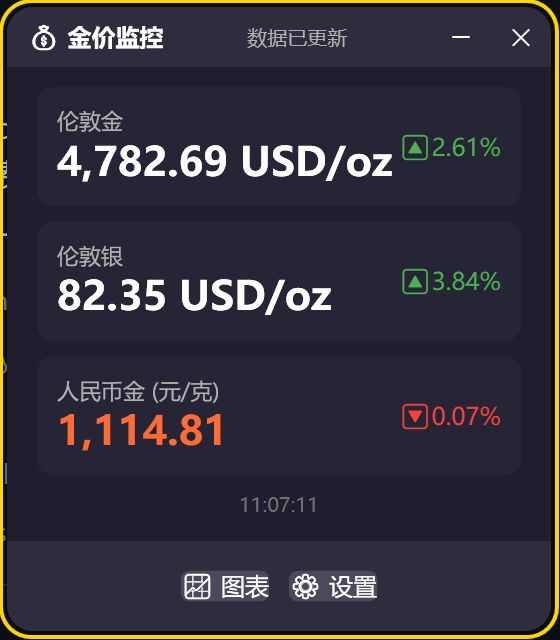
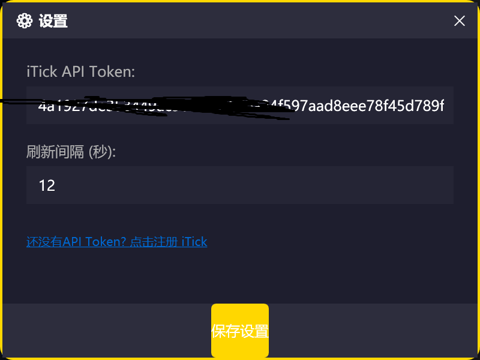
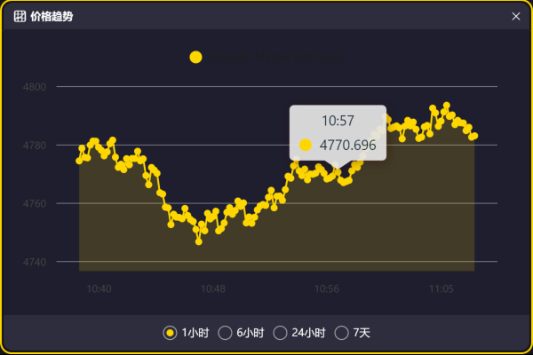

# GoldPriceMonitor - 实时金价悬浮窗

一个轻量的 WPF 桌面应用，用于实时展示伦敦金 / 伦敦银 / 人民币金价，并提供趋势图表与系统托盘常驻。

## 功能特性
- 实时价格：伦敦金 (XAUUSD)、伦敦银 (XAGUSD)
- 人民币金价（元/克）自动换算显示
- 悬浮窗显示，置顶不遮挡工作区
- 系统托盘常驻，右键菜单操作
- 价格趋势图（1小时 / 6小时 / 24小时 / 7天）

## 效果图





## 环境要求
- Windows 10/11
- .NET 10 SDK（运行/编译需要）

下载地址：
https://dotnet.microsoft.com/download/dotnet/10.0

## 快速开始（推荐）
1. 安装 .NET 10 SDK
2. 获取 iTick API Token
   - 访问 https://www.itick.io 注册并登录
   - 在个人信息/控制台中创建并复制 API Token
3. 双击运行 `run.bat`
   - 会自动构建并启动程序
4. 打开“设置”窗口填入 API Token，保存即可显示实时数据

## 使用说明
- 程序启动后会显示一个悬浮窗
- 右键托盘图标可打开菜单（显示/隐藏/退出）
- 点击“图表”按钮查看价格趋势
- 点击“设置”按钮可填写 Token、调整刷新间隔（秒）

## 从源码运行
```bash
# 还原依赖
dotnet restore

# 编译
dotnet build -c Release

# 运行
dotnet run
```

## 打包发布
```bash
# 生成可分发输出
dotnet publish -c Release -r win-x64 --self-contained false -o publish
```

## 常见问题
- 价格不显示：请确认已在设置中填写有效 API Token
- 图标/窗口不显示：尝试在托盘中查看是否被隐藏
- 图表为空：需要等待程序采集到足够的实时数据

## 目录结构
```
GoldPriceMonitor/
├─ Models/         # 数据模型
├─ Services/       # API 服务 / 热键等
├─ ViewModels/     # MVVM 视图模型
├─ Views/          # 窗口与界面
├─ Utils/          # 工具类
└─ Resources/      # 资源文件
```
